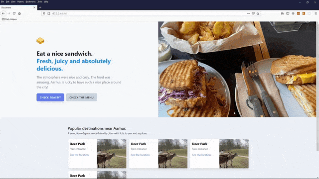

# Learning Tailwind CSS

This repository contains the code that I wrote while learning [Tailwind CSS](https://tailwindcss.com/) during my Web Developer Internship.

I will update it when I want to experiment something in Tailwind CSS.

## Tools that I've used

- [VS Code](https://code.visualstudio.com/) as the editor
- [Tailwind CSS Intellisense](https://marketplace.visualstudio.com/items?itemName=bradlc.vscode-tailwindcss) for intelligent auto-completion in VS Code

